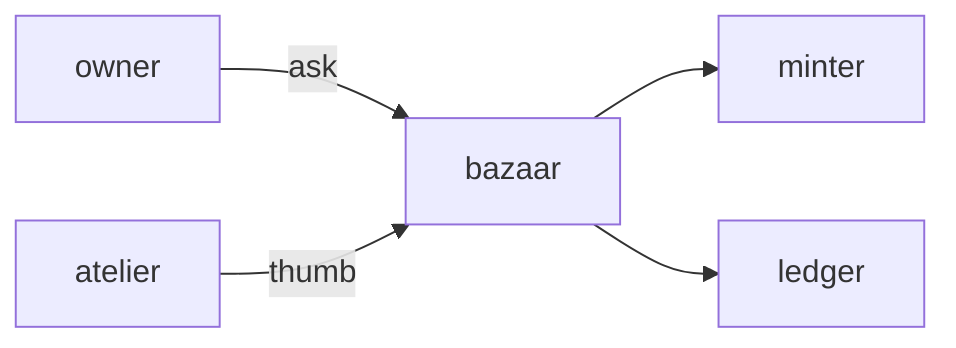

# Bazaar

**NFT Marketplace** — Web portal for trading pets, traits, and in-game items under the ComputerPets canon.

Part of [ComputerPets](https://github.com/RicheyWorks/computerpets). Map: [computerpets-ecosystem](https://github.com/RicheyWorks/computerpets-ecosystem).

| | |
| --- | --- |
| Status | Design scaffold — contract frozen, implementation next |
| License | MIT |
| First pet | Still [Rui on the desktop](https://github.com/RicheyWorks/computerpets/blob/main/docs/START-HERE.md). This organ is optional. |

## The job

Flagship already verifies Ethereum NFT ownership. Bazaar is the storefront: listings, royalties, and trait swaps — never a random OpenSea skin dump.

The flagship overlay already puts a living sticker on the real desktop (Rui first, 210 kinds). Bazaar does not replace that. It is one organ.

## Who uses it

Owners who want to trade traits and items. Steam-only pets cannot list on-chain.

## What it is not

Not OpenSea with our logo. Listings go through Minter. No stolen art dumps.

## Architecture



## Stack

TypeScript · React 19 · Vite · wagmi / viem · Spring + web3j listings API · IPFS metadata

GroupId / namespace: `com.enterprisepet.bazaar`  
Default listen: `8080`

## Contract

### Data

`Listing(id, tokenId, priceWei, seller) · Fill(txHash, buyer) · RoyaltySplit(bps, address)`

### Surface

- GET /v1/listings?species=&slot= — active asks
- POST /v1/listings — signed ask from a verified owner
- POST /v1/fill — escrow + transfer via Minter
- GET /v1/royalties/{collection} — creator cuts

### Failure doctrine

Chain reorg → listing frozen until confirmations. Unverified Steam-only pet → cannot list on-chain. Wallet reject → no partial debit.

## First slice

Build this and stop. Do not boil the ocean.

**Read-only listing grid filtered by species + one signed ask flow against a test NFT.**

You know it works when: Unverified pet cannot list. Wallet reject: no ledger debit. Reorg: listing frozen until confirms.

## Environment

`VITE_CHAIN_ID`, `VITE_MINTER_URL`, `VITE_WALLETCONNECT_ID`

Never commit secrets. Never put Steam or chain keys in the overlay.

## Neighbors

- computerpets-minter
- computerpets-ledger
- computerpets-atelier
- computerpets Spring NFT verifier

## Layout

```
computerpets-bazaar/
  README.md           this file
  LICENSE             MIT
  docs/CONTRACT.md    the same contract, frozen for implementers
  src/                implementation lands here
```

## Run (Windows)

PowerShell, from this folder, after the flagship helpers (Git, Node LTS 22+, JDK 21 as needed):

```powershell
cd app; npm install; npm run dev
```

You do not need this service to meet Rui. The [flagship start-here](https://github.com/RicheyWorks/computerpets/blob/main/docs/START-HERE.md) is still the first pet.

## Links

- Flagship: [RicheyWorks/computerpets](https://github.com/RicheyWorks/computerpets)
- This repo: [RicheyWorks/computerpets-bazaar](https://github.com/RicheyWorks/computerpets-bazaar)
- Map: [RicheyWorks/computerpets-ecosystem](https://github.com/RicheyWorks/computerpets-ecosystem)
- Contract file: [docs/CONTRACT.md](docs/CONTRACT.md)

## License

MIT. See [LICENSE](LICENSE).

---

*Two hundred ten living kinds. Keep them so a line does not go quiet.*
